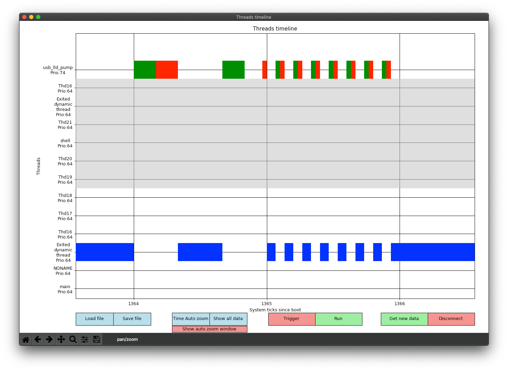

threads_utilities_ChibiOS
=========================
Small library containing several functions to obtain statistics about the threads running like the stack usage or the MCU usage. Another feature is to record the timestamps when ChibiOS does a context switch. Depending on the size allocated for this, a timeline can then be drawn with a python script which gets the data through the USB Shell of ChibiOS.

Table of content
----------------

- [How to add the library to a project](#How-to-add-the-library-to-a-project)
- [Versions](#versions)
- [Timestamps functionality](#timestamps-functionality)
  - [Prerequisite C](#prerequisite-c)
  - [How it works](#how-it-works)
  - [Thread logging selection](#thread-logging-selection)
  - [Trigger/Run](#triggerrun)
  - [Threads Timeline tool](#threads-timeline-tool)
    - [Usage](#usage)
    - [Functionalities](#functionalities)
    - [Interpreting the timeline](#interpreting-the-timeline)
      - [Typical timeline](#typical-timeline)
      - [Time subdivisions](#time-subdivisions)
      - [Non logged threads](#non-logged-threads)
      - [Exited threads](#exited-threads)
      - [Trigger](#trigger)
- [Shell commands](#shell-commands)


How to add the library to a project
-----------------------------------

To include the library to your ChibiOS project, simply follow the steps below.

1. Add this git as a submodule (or as a simple folder) to your project.
2. Add the specific variables below to your makefile before the **CSRC** definition
	-	``THDULIB``						: Path to the **threads_utilities_ChibiOS** folder you just added (relative to the ChibiOS makefile)
	-	``USE_THREADS_TIMESTAMPS``		: **true** or **false**. Tells if you want to enable the Timestamps functionality
	-	``THREADS_TIMESTAMPS_LOG_SIZE``	: Size of the buffer for the Timestamps functionality (uint32_t values)
	- ``THREADS_TIMESTAMPS_DEFAULT_LOG`` : **true** or **false**. Whether all the threads are logged by default or not
	-	``include $(THDULIB)/threads_utilities.mk``
3. Add these variables in your makefile if it's not already the case
	-	``$(ALLCSRC)`` 	to 	``CSRC``
	-	``$(ALLINC)`` 	to 	``INCDIR``
	-	``$(ALLDEFS)`` 	to 	``UDEFS``

For example with this folder structure :
```
Your_project/
├───threads_utilities_ChibiOS/
│   ├──threads_utilities.mk
│   └──...
├───another_submodule/
└───src/
    ├──makefile
    ├──main.c
    └──...
```
You would add these lines to your makefile :

```makefile
...


THDULIB = ../threads_utilities_ChibiOS
USE_THREADS_TIMESTAMPS = yes
THREADS_TIMESTAMPS_LOG_SIZE = 3000
THREADS_TIMESTAMPS_DEFAULT_LOG  =  false
include $(THDULIB)/threads_utilities.mk

...

# C sources that can be compiled in ARM or THUMB mode depending on the global
# setting.
CSRC =  $(ALLCSRC) \
        ...        \
        ...

...

INCDIR = $(ALLINC) \
         ...       \
         ...

# List all user C define here, like -D_DEBUG=1
UDEFS = $(ALLDEFS) \
        ...        \
        ...

...
```

Versions
--------
In this repository, you can find two main versions of the library (two branches) named **ChibiOS_3.1** and **ChibiOS_18.2**. There are two versions simply because some big changes have been done between these two versions of ChibiOS and we needed to have this library working with the [e-puck2 code](https://github.com/e-puck2/e-puck2_main-processor).
That said it has only been tested with these specific versions of ChibiOS. Newer versions may work with the **ChibiOS_18.2** though.

Timestamps functionality
------------------------

The Timestamps functionality records each time the system enters or leaves a thread.
These times are stored in a buffer of uint32_t and of size ``THREADS_TIMESTAMPS_LOG_SIZE``.

The size used in memory is then equal to  4 * ``THREADS_TIMESTAMPS_LOG_SIZE`` bytes.

It's up to you to choose the size of the logs, which one element directly corresponds to a context switch in ChibiOS. Indeed, each time we leave a thread and enter into another one, a timestamp is logged. The buffer is a circular buffer that records the timestamps continuously until a trigger is set. 

We can then recover these data and show them on a timeline with the provided Python 3 script findable in **/Python/plot_threads_timeline.py**


### Prerequisite C

1. The recording of the timestamps uses the Hooks possibilities of ChibiOS. Thus, it is necessary to add some lines to the **chconf.h** file of your project as followed.

Add the following lines before the ``CH_CFG_THREAD_EXTRA_FIELDS`` hook

```c
#define TIMESTAMPS_INCLUDE
#include "threads_utilities_chconf.h"
```

Then, for each of the four hooks below, add the four macros ``TIMESTAMPS_THREAD_EXTRA_FIELDS``, ``TIMESTAMPS_THREAD_INIT_HOOK``, ``TIMESTAMPS_THREAD_EXIT_HOOK(tp)`` and ``TIMESTAMPS_CONTEXT_SWITCH_HOOK(ntp, otp)`` to the corresponding hooks:

This should give something like this (be careful to put correctly the ``\`` at the end of the lines):

```c
#define TIMESTAMPS_INCLUDE
#include "threads_utilities_chconf.h"
/**
 * @brief   Threads descriptor structure extension.
 * @details User fields added to the end of the @p thread_t structure.
 */
#define CH_CFG_THREAD_EXTRA_FIELDS                                          \
    /* Add threads custom fields here.*/                                    \
    TIMESTAMPS_THREAD_EXTRA_FIELDS                                          \

/**
 * @brief   Threads initialization hook.
 * @details User initialization code added to the @p chThdInit() API.
 *
 * @note    It is invoked from within @p chThdInit() and implicitly from all
 *          the threads creation APIs.
 */
#define CH_CFG_THREAD_INIT_HOOK(tp) {                                       \
        /* Add threads initialization code here.*/                          \
        TIMESTAMPS_THREAD_INIT_HOOK                                         \
}
/**
 * @brief   Threads finalization hook.
 * @details User finalization code added to the @p chThdExit() API.
 *
 * @note    It is inserted into lock zone.
 * @note    It is also invoked when the threads simply return in order to
 *          terminate.
 */
#define CH_CFG_THREAD_EXIT_HOOK(tp) {                                       \
        /* Add threads finalization code here.*/                            \
        TIMESTAMPS_THREAD_EXIT_HOOK(tp)                                     \
}

/**
 * @brief   Context switch hook.
 * @details This hook is invoked just before switching between threads.
 */
#define CH_CFG_CONTEXT_SWITCH_HOOK(ntp, otp) {                              \
        /* Context switch code here.*/                                      \
        TIMESTAMPS_CONTEXT_SWITCH_HOOK(ntp, otp)                            \
}
```


To be able to send the data, we use the standard USB Shell functionality of ChibiOS. You can find a lot of examples of its use in the **testhal** folder of ChibiOS. They contain the usbcfg.c/.h files to configure the USB and the initialization of the Shell.
When you have a shell working, you need to add the following line in the commands of the Shell to add the thread_utilities commands:

2. Add ``THREADS_UTILITIES_SHELL_CMD`` inside the ``ShellCommand`` array.

For example the following ``ShellCommand`` array : 

```c
...
static const ShellCommand commands[] = {
  {"mem", cmd_mem},
  {"threads", cmd_threads},
  {"test", cmd_test},
  {"write", cmd_write},
  {NULL, NULL}
};
...
```
Would become :

```c
...
static const ShellCommand commands[] = {
  {"mem", cmd_mem},
  {"threads", cmd_threads},
  {"test", cmd_test},
  {"write", cmd_write},
  THREADS_UTILITIES_SHELL_CMD
  {NULL, NULL}
};
...
```
3. Don't forget to include ``threads_utilities.h`` in the files that use a **threads_utilities** function.

### How it works
The way the MCU records the logs and the script processes them is made such that the creation or deletion of threads, whether they are dynamic or static is handled.
It works as follow:
- On the MCU side:
  -	The MCU maintains an internal list of the threads alive. This list is different from the threads registry of ChibiOS for the main reason that exited dynamic threads are still in the registry, which is a problem for the logs.
  - On each context switch, if the IN or OUT thread is marked to be logged, a log record containing the time and the IN and OUT thread number will be created.
  - If a context switch is done between two threads that are not marked to be logged, it is simply ignored. But since a log is recorded if at least one of the two thread need to be logged, we also have data for non logged threads. This lets us partially reconstruct the timeline with incomplete data for the threads that have interacted with the logged threads.
  - If a thread is exited, it will write a log with the time and the IN and OUT thread numbers will be equal to the exited thread to differentiate this log from a normal context switch log. The exited thread will also be added to a circular buffer that lists the exited threads which still have logs related to them.
  - When we have no more data of an exited thread in the logs, this thread is removed from the exited thread list. Note this list only stores a pointer to the thread and its number if it's a static thread or its number and some specific informations if it's a dynamic thread (because its memory can be released).
  -The data are meant to be asked via the ChibiOS Shell with the **threads_list** and **threads_timestamps** commands.
- On the python script side:
  - When the python script have to get new data, it asks for the list of the threads with the command **threads_list** and it creates the data structures related to these threads.
  - Then it asks for the timestamps with the command **threads_timestamps** and processes the timestamps to reconstruct the history of the creation and deletions of the threads and dispatches the IN and OUT times to the corresponding threads. This step is necessary because the threads numbering is based on the creation order of the threads. If a thread is created it is added at the end of the list but if a thread is exited, then it is removed from the list, which means all the thread after in the list have their number decreased by one.
  - Finally it converts these times to rectangles in order to draw them on the graph.

Note : it is possible to interpret the data sent by the MCU, they are formatted to be readable by a human. The only tricky part is if a thread has been exited, then some numbers for the thread are shifted and other not, depending if these threads have been created before or after the exited thread. 

Example of a thread list returned by the MCU :
```
threads_list
Thread number  1 : Prio =  64, Log = Yes, Name = main
Thread number  2 : Prio =   1, Log = Yes, Name = idle
Thread number  3 : Prio =  74, Log = Yes, Name = usb_lld_pump
Thread number  4 : Prio =  64, Log = Yes, Name = NONAME
Thread number  5 : Prio =  64, Log = Yes, Name = shell
Deleted threads: 
Thread number  9 : Prio =  64, Log = Yes, Name = Thd19
Thread number  8 : Prio =  64, Log = Yes, Name = Thd18
Thread number  9 : Prio =  64, Log = Yes, Name = Thd20
Thread number  5 : Prio =  64, Log = Yes, Name = Exited dynamic thread
Thread number  5 : Prio =  64, Log = Yes, Name = Thd16
Thread number  5 : Prio =  64, Log = Yes, Name = Thd17
Thread number  6 : Prio =  64, Log = Yes, Name = Thd21
Thread number  6 : Prio =  64, Log = Yes, Name = Exited dynamic thread
Thread number  6 : Prio =  64, Log = Yes, Name = Thd16

```
Here we can see that we have 5 threads alive and 9 threads that have been exited and which data are still in the logs, all of them being logged. Their number correspond to the number they had when they were alive. The deleted threads are written in the order they were deleted, this lets us reconstruct what the original order of creation was. This post-processing is used to do the least amount of computation on the MCU side and use the least amount of memory. When an exited thread is dynamic, it's name is not kept to save memory so it is set to the generic name **Exited dynamic thread**.

For this case, the creation order of the threads would be :
```
Thread number  1 : Prio =  64, Log = Yes, Name = main
Thread number  2 : Prio =   1, Log = Yes, Name = idle
Thread number  3 : Prio =  74, Log = Yes, Name = usb_lld_pump
Thread number  4 : Prio =  64, Log = Yes, Name = NONAME
Thread number  5 : Prio =  64, Log = Yes, Name = Exited dynamic thread
Thread number  6 : Prio =  64, Log = Yes, Name = Thd16
Thread number  7 : Prio =  64, Log = Yes, Name = Thd17
Thread number  8 : Prio =  64, Log = Yes, Name = Thd18
Thread number  9 : Prio =  64, Log = Yes, Name = Thd19
Thread number 10 : Prio =  64, Log = Yes, Name = shell
Thread number 11 : Prio =  64, Log = Yes, Name = Thd20
Thread number 12 : Prio =  64, Log = Yes, Name = Thd21
Thread number 13 : Prio =  64, Log = Yes, Name = Exited dynamic thread
Thread number 14 : Prio =  64, Log = Yes, Name = Thd16
```

Example of some timestamps for this thread list returned by the MCU :

```
From  8 to  9 at    1581
From  9 to  9 at    1581
From  0 to  2 at    1581
From  2 to 10 at    1591
From 10 to  2 at    1601
From  2 to  5 at    1630
```
Each line corresponds to a context switch from a thread number to another thread number at a given time (ChibiOS System tick). In this example, we can see that the thread 9 (**Thd19**) is exited at the time 1581. The next line tells us we leave an exited thread (0 because not in the list anymore) and enter in the thread number 2, **idle** in this case. Now that the 9th thread has been deleted, the thread 10 we enter in one line after doesn't reference the thread **shell** as it was before but the thread **Thd20**.

### Thread logging selection

A logged thread will always have pairs of IN and OUT times after the post-processing of the logs simply because every context switch related to this thread was recorded.
A not logged thread will have some IN and some OUT times, sometimes related, sometime not. Because of this, they are drawn and handled differently in the script.

Several ways are provided to select which thread to log or not.

- The first thing configurable is the ``THREADS_TIMESTAMPS_DEFAULT_LOG`` setting in the makefile. It is used to choose if by default the created threads will be logged or not.
- Then in the code, this setting can be changed by the functions ``logNextCreatedThreadsTimestamps()`` and ``dontLogNextCreatedThreadsTimestamps()``. They are meant to be called around threads creations to log only a group of threads for example, or alone to log/not log the next created threads.
- It is also possible to use inside a thread the functions ``logThisThreadTimestamps()`` and/or ``dontLogThisThreadTimestamps()`` to only change the setting of this thread in particular. It needs to be made as soon as possible in the thread to not miss/record a context switch.

It's not advised to change the log setting of a thread during it's runtime. It should be done before its creation or be the first thing made by the thread, otherwise, the logs will not be coherent with this setting. Especially if a thread was not logged during some time and then is marked as logged, the first logs will still be incomplete and the timeline drawn by the python script will be completely wrong for theses logs.

These functions can be used before the initialization of ChibiOS. It can be useful to log the **main** and **idle** threads that are created inside the **chSysInit()** function for example. 

### Trigger/Run

When the trigger is set, the logs will continue to log until a given point to try to have the same number of logs before and after the trigger time. When the trigger is removed, the logs are emptied (otherwise we have really old data with new data, which means a big empty space on the timeline and incomplete timestamps) and begin to log continuously again until the next trigger. 

It's possible to set the trigger with a command either directly through the Shell or with the python script, but also in the code with the function ``setTriggerTimestamps()``. This lets the user trigger at a precise line in his code without knowing exactly when it should be. The function takes a name as argument, this lets the user name the trigger to know which one triggered if multiple triggers are put in the code.
If a trigger is already set, the function does nothing.

Even if it's useless to do it directly in the code, it is also possible to reset the trigger (remove it) with the function ``resetTriggerTimestamps()``. It's more logical to only call it via the python script with the button **Run**.

These functions can not be used before the initialization of ChibiOS because they use a **chSysLock()** function.

### Threads Timeline tool
The python3 script provided is made to connect to the MCU and download the logs to draw them on a timeline.

#### Usage

To use the python script, **python3**, as well as **matplotlib** and **pySerial** should be installed.

Then, if the Shell works correctly on the MCU side, you can simply launch the script with the following lines :
 ```
 python3 ./plot_threads_timeline.py ComPort
```

With ``ComPort`` being the USB com port to which the Shell is connected.

Then with the matplotlib window opened, it is possible to use the navigation tools (bottom left) to zoom and move inside the timeline. 
``Left`` and ``Right`` arrows act respectively like Undo and Redo buttons for the view and pressing ``x``or ``y`` while zooming changes the zoom selection to respectively zooming only in the **X** or **Y** axis.

A more convenient and smooth way of navigating in the timeline is by selecting the ``pan/zoom`` button on the bottom left toolbar. Then, with the mouse, it's possible to move with the ``left click`` and zoom with the ``right click``. Note that this tool is selected by default when the script is launched.

#### Functionalities
The logs work similarly to an oscilloscope. You can press the **Trigger** button, which will stop the recording of the logs at some point in order to have data before and after the trigger time (represented by a red line) and you can press the **Run** button to remove the trigger and let the recording of the logs work continuously.

When you want to get the data, you can press the **Get new data** button.

There is also the possibility to save or load the data into/from a ``.txt`` file. The data and the current view will be saved to the file and when a file is opened, the data and the view will be recovered. This file can also be useful to debug since the data written are directly what is sent by the MCU before any processing from the script.

The script will also write messages to the terminal for nearly each action of the user.

Finally, depending on the zoom level, a lot of information are not visible until you zoom in enough to make them drawable by matplotlib.

#### Interpreting the timeline
##### Typical timeline

Here is an example of the type of timeline you could obtain with the script. Of course a lot of data are displayed, it is needed to zoom a lot to begin to see useful information.


The threads are ordered from bottom to top by priority order and then by creation order. This means the lowest priority threads are on the bottom and for the same priority, a thread below an other has been created before it and etc.

##### Time subdivisions

Since it's highly possible to have multiple context switches during the same system tick, we can not know the exact duration of a thread before switching to another. To still represent all the switches, the duration width of an active thread is dependent on how many context switches happened during the same system tick. For example on the image below, we can see that between the millisecond 1300 and 1301, we switched 13 times so the width drawn is 1/14 of millisecond. The same between the milliseconds 1301 and 1302 but this time with a width of 1/12 because less switches happened.
Of course if a thread was used at least one millisecond, then it's duration on the timeline will begin to be more accurately drawn, the limitation being the system tick frequency of ChibiOS.


##### Non logged threads
When a thread is not logged, we can still have incomplete data if they switched to or from a logged thread. For these threads, the IN times are drawn in smaller green rectangles and the OUT in red rectangles. This let the user know which threads interacted with the logged threads but without knowing exactly how much time the system was in the non logged thread and if these threads were interrupted by others non logged threads.



##### Exited threads

Exit_threads
When a thread is exited, a longer red line is drawn at the end of its last timestamp on the timeline. For example the threads **Thd16** and a dynamic thread are exited on the image below.


##### Trigger
Finally the trigger is represented by a red line of covering all the threads on the timeline. It has been set on the time 3500 on the example below.


Shell commands
--------------

The following commands are provided to the shell with ``THREADS_UTILITIES_SHELL_CMD`` :

Always available :
- ``threads_stat`` : Prints a list of the running threads (from the ChibiOS thread registry) and some stats about their stacks.
- ``threads_uc`` : Prints a list of the running threads (from the ChibiOS thread registry) and some stats about their time usage. Similar to the uC usage on a computer.

Only available with ``USE_THREADS_TIMESTAMPS = true`` :
- ``threads_list`` : Prints a list of the threads (internal list) alive and deleted.
- ``threads_timestamps`` : Prints the timestamps logged until now.
- ``threads_timestamps_trigger`` : Sets the trigger. Also print its name and at which time the trigger occurred.
- ``threads_timestamps_run`` : Removes the trigger.

